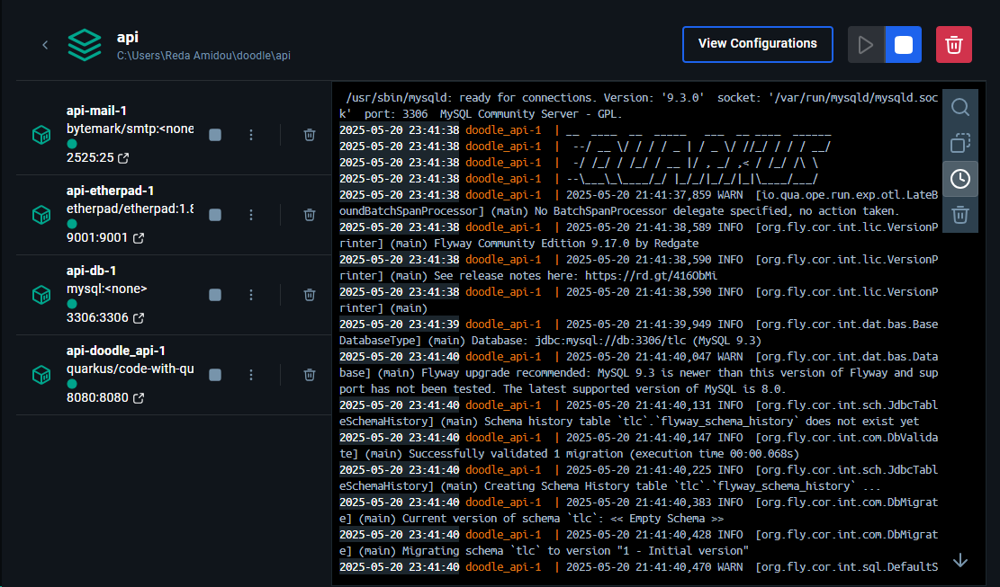
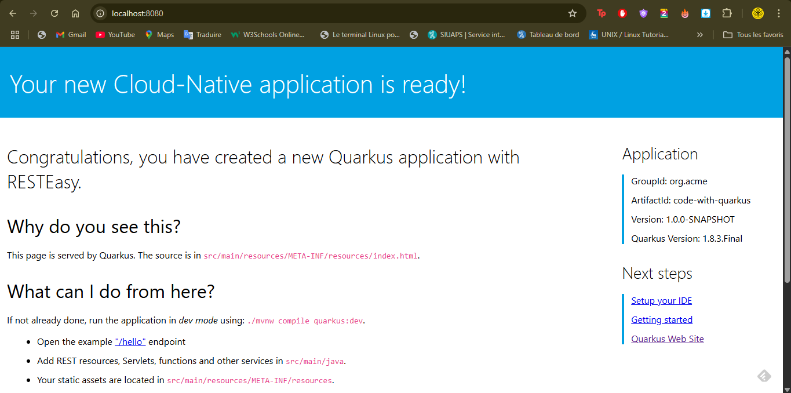
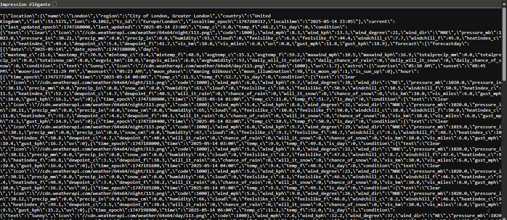

# Cloud-native applications and microservice architecture

### Réalisé par :

**Reda Amidou**, **Eya Sammari**, **Ayat Allah Anouar** et **Mey Cherif**


## 🔍 Introduction

Ce projet s’inscrit dans une démarche de modernisation d’une application existante (Doodle App) selon les principes de l’**architecture cloud-native** et de la **conception orientée microservices**.

L'objectif principal était de :
- Migrer un projet Quarkus obsolète vers une version moderne (v3.x)
- Concevoir une architecture modulaire et extensible
- Intégrer un nouveau microservice météo en Node.js
- Dockeriser l’ensemble des services pour garantir portabilité, scalabilité et facilité de déploiement
- Orchestrer l’ensemble avec **Docker Compose**


## 📑 Sommaire

* [Outils DevOps et technologies utilisés](#outils-devops-et-technologies-utilises)
* [Migration et mise a jour du projet Maven](#migration-et-mise-a-jour-du-projet-maven)
* [Doodle App - Setup, Microservices, Docker Integration](#doodle-app---setup-microservices-docker-integration)

  * [Prerequis](#prerequis)
  * [Etapes dinstallation](#etapes-dinstallation)
* [Quarkus Application - Mode Fast JAR avec Docker](#quarkus-application---mode-fast-jar-avec-docker)
* [Ajout du Microservice Forecast (Prevision meteo)](#ajout-du-microservice-forecast-prevision-meteo)

  * [Creation du microservice forecast](#creation-du-microservice-forecast)
  * [Dockerisation du microservice](#dockerisation-du-microservice)
  * [Integration avec lapi quarkus](#integration-avec-lapi-quarkus)
* [Lancer toute l'application en une seule commande](#lancer-toute-lapplication-en-une-seule-commande)
* [Retour dexperience : difficultes rencontrees et solutions](#retour-dexperience--difficultes-rencontrees-et-solutions)
* [Conclusion](#conclusion)


### 🛠️ Outils DevOps et technologies utilisés

| Catégorie              | Outils / Technologies                                      |
|------------------------|-----------------------------------------------------------|
| Langages               | Java 17, Node.js                                          |
| Frameworks             | Quarkus 3.2.3, Express.js                                 |
| Conteneurisation       | Docker, Docker Compose                                   |
| Gestion des dépendances | Maven, npm                                               |
| API externe            | WeatherAPI (https://www.weatherapi.com/)                 |
| Monitoring / Tracing   | OpenTelemetry, Jaeger (support dans Quarkus)             |
| Base de données        | MySQL (via Flyway pour la migration)                     |

---


### Migration et mise à jour du projet Maven

Lors de la reprise du projet, nous avons rencontré plusieurs problèmes liés à la compatibilité des dépendances, en particulier autour de l'utilisation des bibliothèques basées sur `javax.*`, devenues obsolètes avec les nouvelles versions de Quarkus (3.x). Le projet original utilisait Quarkus en version `1.10.5.Final` et Java 11. Or, certaines bibliothèques `javax.*` ne sont plus compatibles avec les versions récentes de Quarkus, qui se basent désormais sur le namespace `jakarta.*`.

Nous avons donc entrepris une migration vers Quarkus `3.2.3.Final` et mis à jour Java vers la version 17 pour bénéficier des dernières fonctionnalités et assurer une compatibilité optimale avec les bibliothèques modernes. Cela a nécessité :

* **La modification des propriétés Maven** :

  * `maven.compiler.source` et `maven.compiler.target` sont passés de 11 à 17.
  * Le BOM Quarkus a été mis à jour : `quarkus-universe-bom` remplacé par `quarkus-bom`.
  * Les versions des plugins Quarkus et OpenTelemetry ont été alignées sur la version 3.2.3.

* **Remplacement des dépendances obsolètes ou incompatibles** :

  * `quarkus-resteasy` et `quarkus-resteasy-jackson` ont été remplacés par `quarkus-resteasy-reactive` et `quarkus-resteasy-reactive-jackson`.
  * La dépendance `quarkus-smallrye-opentracing` a été remplacée par les dépendances OpenTelemetry : `quarkus-opentelemetry` et `quarkus-opentelemetry-exporter-otlp`.
  * `javax.mail` a été remplacé par `jakarta.mail-api`.

* **Mise à jour des bibliothèques de migration Flyway** :

  * Ajout explicite de la dépendance `flyway-mysql` pour s'assurer de la compatibilité avec MySQL.

* **Conversion de tous les imports `javax.*` vers `jakarta.*` dans le code source** :
  Cette étape a été nécessaire car certaines bibliothèques (comme `javax.mail` ou `javax.cache`) n'existent plus sous le nom `javax` dans les nouvelles versions, ce qui provoquait des erreurs de compilation ou d'exécution lors de l'appel de certaines commandes Maven ou lors du lancement de l'application.

Ces modifications étaient indispensables pour garantir le bon fonctionnement du projet avec les versions modernes de Quarkus et Java, améliorer la sécurité, la performance et la maintenabilité du code. Cette migration a également permis de corriger des erreurs bloquantes rencontrées initialement, telles que des erreurs de classe non trouvée (`ClassNotFoundException`) ou d’injection de dépendance échouée.

---

# Doodle App - Setup, Microservices, Docker Integration

##  Contexte

Ce projet est basé sur l'application Doodle, destinée à la gestion de sondages. Nous avons enrichi le projet en :

- Corrigeant les problèmes de build avec Quarkus et Maven
- Ajoutant un microservice météo en Node.js
- Intégrant ce microservice à l'API principale
- Dockerisant l'ensemble des services
- Créant un setup permettant de tout lancer avec `docker-compose`

##  Prérequis

- Docker & Docker Compose
- Docker Desktop (Recommandé)
- Node.js (v16 recommandé)
- Maven
- Git


## Étapes d’installation

### 1. Clone du projet

```bash
git clone https://github.com/redaamd/doodle_cloud_native.git
cd doodle
```

#  Quarkus Application - Mode Fast JAR avec Docker

Tout d'abord on passe au dossier `api`, avec la commande : 

```bash
cd api
```

Ce projet utilise Quarkus avec un support du mode `fast-jar` pour des performances optimisées.

##  Structure Docker

Un fichier `Dockerfile.fast-jar` a été ajouté dans `src/main/docker` pour permettre la création d'une image Docker adaptée au packaging `fast-jar`.

Il repose sur une image Red Hat UBI minimaliste avec Java 17 et permet de lancer l'application de manière légère et rapide.

##  Compiler le projet avec le bon packaging :

```bash
./mvnw clean package "-Dquarkus.package.type=fast-jar"
```

##  Construction de l'image Docker

```bash
docker build -f src/main/docker/Dockerfile.fast-jar -t quarkus/code-with-quarkus-fast-jar .
```

## Intégration avec Docker Compose

Apres on a mis a jour le fichier `docker-compose.yaml` afin de lancer l'application avec une seule commande. On a ajoute un nouveau service :

```yaml
  doodle_api:
    image: quarkus/code-with-quarkus-fast-jar
    restart: always
    ports:
      - "8080:8080"
```

## Remarque sur le redémarrage des conteneurs

Le paramètre `restart: always` est utilisé car l'application a besoin que d'autres microservices soient déjà en cours d'exécution pour fonctionner correctement. Il est donc possible que le conteneur `doodle_api` redémarre plusieurs fois avant de se stabiliser.

## Lancement de l'application

Exécutez la commande suivante pour démarrer tous les services :

```bash
docker-compose up --detach
```

On peut voir sur Docker Desktop que tous les services sont bien lancés :



Et lorsqu’on visite le `localhost:8080`, voici ce que l’on voit dans le navigateur :




---

## ☁️ Ajout du Microservice Forecast (Prévision météo)

### Objectif

Nous avons développé un microservice indépendant en Node.js, appelé **forecast**, permettant de récupérer des prévisions météo via l'API publique [WeatherAPI](https://www.weatherapi.com/). Ce microservice est ensuite **connecté à l’API Quarkus principale**, qui agit comme passerelle pour que le frontend n’interagisse qu’avec une seule API.

---

### 📁 Création du microservice forecast

#### 1. Arborescence

Nous avons créé un dossier à la racine du projet, en revennant a la racine du projet, on execute la commande suivante pour changer de repertoire :

```bash
cd forecastapi
```

#### 2. Fichier `server.js`

Ce fichier contient le cœur du microservice : un petit serveur web basé sur Express qui expose une route `/forecast`.

```js
const express = require('express');
const request = require('request-promise-native')

// Constants
const PORT = 8081;
const HOST = '0.0.0.0';

// App
const app = express();
app.get('/forecast', async (req, res) => {
    const uri = 'http://api.weatherapi.com/v1/forecast.json?key=1baa4a47b6694dd89d274000212911&q=London&days=1&aqi=no&alerts=no'

    const forecast = await request(uri)
    res.json(forecast)
});

app.listen(PORT, HOST);
console.log(`Running on http://${HOST}:${PORT}`);
```


#### 3. Fichier `package.json`

Voici les dépendances et scripts nécessaires pour faire fonctionner notre microservice :

```json
{
    "name": "forecastapp",
    "version": "1.0.0",
    "description": "Forecast app",
    "main": "server.js",
    "scripts": {
        "start": "node server.js"
    },
    "dependencies": {
        "axios": "^1.5.0",
        "express": "^4.21.2",
        "forecastapp": "file:",
        "request": "^2.88.2",
        "request-promise-native": "^1.0.9",
        "xmlhttprequest": "^1.8.0"
    }
}
```

#### 4. Installation des dépendances

```bash
npm install
```

#### 5. Test en local

```bash
npm start
```

On peut naviguez ensuite sur :
📍 [http://localhost:8081/forecast](http://localhost:8081/forecast)


> En effet cette page fournit des données météorologiques détaillées pour la ville de Londres, y compris les conditions actuelles (température, humidité, vent, pression, etc.), les prévisions journalières et horaires pour le 14 mai 2025, ainsi que des informations astronomiques comme les heures de lever et coucher du soleil et de la lune. Le temps est actuellement clair avec une température de 9 °C.


---

### 🐳 Dockerisation du microservice

#### Fichier `Dockerfile`

```Dockerfile
FROM node:10

# Create app directory
WORKDIR /usr/src/app

# Install app dependencies
COPY package*.json ./

RUN npm install

# Bundle app source
COPY . .

EXPOSE 8081
CMD [ "node", "server.js" ]
```

#### Construction de l’image

Nous avons utilisé la commande suivante pour construire l’image Docker à partir du Dockerfile :

```bash
docker build -t redaamd/forecastapi.
```

#### Publication sur Docker Hub

Pour publier l’image sur Docker Hub et la rendre disponible publiquement ou pour d'autres environnements, nous avons exécuté :

```bash
docker login
docker push redaamd/forecastapi
```

L’image est maintenant disponible sur Docker Hub à l’adresse : [https://hub.docker.com/r/redaamd/forecastapi](https://hub.docker.com/r/redaamd/forecastapi)

---

## 🧩 Intégration via Docker Compose

Nous avons ensuite cree notre `docker-compose.yaml` du dossier `forecastapi` pour inclure notre service :

```yaml
version: "3.8"
services:
  forecast:
    image: redaamd/forecastapi
    ports:
      - "8081:8081"

```

---

### 🚀 Lancement du service

```bash
docker-compose up --detach
```


## 🔌 Intégration avec l'API Quarkus

Nous avons créé un **endpoint `/api/weather`** dans l’API Quarkus pour appeler ce microservice.

#### 1. Dépendance de configuration dans `application.yml`

```yaml
doodle:
  weatherServiceUrl: "http://host.docker.internal:8081/"
```

Cela permet de changer facilement l’URL du microservice selon l’environnement.

#### 2. Fichier `WeatherResourceEx.java` dans le dossier `resources/`

```java
@RestController
@RequestMapping("/api")
public class WeatherResourceEx {

    @ConfigProperty(name = "doodle.weatherServiceUrl", defaultValue = "http://host.docker.internal:8081/")
    String weatherServiceUrl = "";

    @GetMapping("/weather")
    public ResponseEntity<String> retrieveWeather() throws InterruptedException, ExecutionException, IOException {
        CloseableHttpAsyncClient client = HttpAsyncClients.createDefault();
        client.start();
        HttpGet request = new HttpGet(weatherServiceUrl + "forecast");

        Future<HttpResponse> future = client.execute(request, null);
        HttpResponse response = future.get();

        ByteArrayOutputStream out = new ByteArrayOutputStream();
        response.getEntity().writeTo(out);
        String responseString = out.toString();
        out.close();
        client.close();

        System.out.println(responseString);

        return new ResponseEntity<>(responseString, HttpStatus.OK);
    }

}
```

#### 3. Redémarrage et build de l’API

```bash
cd api
docker-compose down
```

```bash
./mvnw clean package "-Dquarkus.package.type=fast-jar"
docker build -f src/main/docker/Dockerfile.fast-jar -t quarkus/code-with-quarkus-fast-jar .
docker-compose up --detach
```

---


On attends quelques secondes que les conteneurs se stabilisent. Ensuite, on teste l’API météo :

📍 [http://localhost:8080/api/weather](http://localhost:8080/api/weather)

---

### ✅ Résultat attendu

L'appel à `http://localhost:8080/api/weather` renvoie un JSON contenant les prévisions météo.
Ces données sont obtenues par le microservice Node.js (`forecastapi`) puis relayées par l’API développée en Quarkus.

📸 **Aperçu de la réponse JSON dans le navigateur ou Postman :**




---

## 🚀 Lancer toute l'application en une seule commande

Une fois tous les services prêts (API Quarkus, microservice forecast, base de données, etc.), on peut démarrer l’ensemble de l’application **avec une seule commande** grâce à `docker-compose`.


### 🧹 Étape préliminaire : supprimer un conteneur existant

Avant de lancer l’application, assurez-vous qu’**aucun conteneur des versions précédentes** n’est en cours d'exécution, notamment s’il y a eu des modifications dans les images. Si nécessaire, supprimez le conteneur concerné :

```bash
docker container rm [nom_du_conteneur] --force
```

> Par exemple, pour supprimer un ancien conteneur de l’API :

```bash
docker container rm doodle_api --force
```

---

### ▶️ Lancer tous les services (API + forecast)

A la racine du projet, Utilisez cette commande pour démarrer tous les services définis dans les deux fichiers `docker-compose` :

```bash
docker-compose -f api/docker-compose.yaml -f forecast/docker-compose.yaml up -d
```

> Cette commande démarre tous les services **en arrière-plan** (`-d`) à partir des fichiers `docker-compose.yaml` localisés dans les dossiers `api/` et `forecast/`.

Vous pouvez maintenant accéder à :

* 🌤️ **Météo** via : [http://localhost:8080/api/weather](http://localhost:8080/api/weather)
* 📊 **API principale** sur : [http://localhost:8080](http://localhost:8080)

---

### ⛔ Arrêter tous les services

Pour arrêter proprement l'ensemble de l'application :

```bash
docker-compose -f api/docker-compose.yaml -f forecast/docker-compose.yaml down
```

Cela arrête tous les conteneurs lancés et libère les ports associés.


---

## 🛠️ Retour d'expérience : difficultés rencontrées et solutions

Durant la mise en place de ce projet, plusieurs difficultés techniques ont impacté notre progression, notamment liées à la migration vers Quarkus 3.x et l’intégration des microservices dans un environnement Docker.

### Principales difficultés rencontrées

* **Migration des dépendances `javax.*` vers `jakarta.*`**
  Le passage de Quarkus 1.x à 3.x impose l’utilisation du namespace `jakarta.*` au lieu de `javax.*`. Cette évolution majeure a provoqué de nombreux problèmes de compilation et d’exécution, notamment des erreurs de classes introuvables (`ClassNotFoundException`) et d’injection de dépendances échouée.

* **Incompatibilités entre versions des bibliothèques et plugins Maven**
  Certaines dépendances utilisées dans l’ancien projet étaient obsolètes ou incompatibles avec Java 17 et Quarkus 3.x, ce qui a nécessité des recherches approfondies pour trouver les versions correctes et alternatives à utiliser.

* **Gestion des conteneurs Docker et redémarrage cyclique**
  Lors de l’orchestration avec Docker Compose, le microservice principal redémarrait plusieurs fois au lancement à cause de dépendances non satisfaites avec d’autres services, ce qui a complexifié le debugging.

* **Intégration entre microservices Node.js et Quarkus**
  La communication interservices via HTTP a nécessité la configuration d’URLs dynamiques selon l’environnement Docker, ainsi que la gestion de problèmes réseau liés au contexte Docker.

### Solutions mises en place

* **Mise à jour rigoureuse des dépendances et refactorisation du code**
  Tous les imports `javax.*` ont été remplacés par `jakarta.*`. Les dépendances Maven ont été mises à jour avec les versions compatibles Quarkus 3.x, et les plugins ajustés en conséquence.

* **Documentation et recherche approfondie**
  Nous avons consulté la documentation officielle Quarkus, des forums, et des issues GitHub pour comprendre les causes des erreurs et adopter les meilleures pratiques.

* **Utilisation de `restart: always` et délais d’attente**
  Pour gérer le redémarrage des conteneurs, nous avons utilisé l’option Docker `restart: always` et veillé à lancer les services dans un ordre permettant une montée en charge progressive.

* **Paramétrage flexible des URLs dans `application.yml`**
  La configuration de l’URL du microservice météo dans `application.yml` avec une variable permet une adaptation facile entre développement local et Docker.

* **Tests manuels et automatisés**
  Nous avons réalisé des tests à chaque étape (build, lancement Docker, appels API) pour valider l’intégration et corriger rapidement les erreurs.


---


## ✅ Conclusion

Ce projet nous a permis de mettre en œuvre **les principes fondamentaux du cloud-native** :
- Découplage des services (microservices autonomes)
- Portabilité via Docker
- Configuration centralisée et flexible
- Interopérabilité grâce aux API REST
- Intégration continue facilitée

La migration vers Quarkus 3.x avec Java 17 a assuré la **pérennité du projet**, tout en améliorant la performance, la sécurité et la compatibilité avec les outils modernes.

Le microservice météo a démontré la **facilité d’extension d’une architecture microservices**, permettant d’ajouter des fonctionnalités sans impacter les autres composants.

En résumé, cette application est un exemple concret de **modernisation réussie d’un système existant** selon les standards cloud-native et DevOps, en assurant **maintenabilité, évolutivité et résilience**.


